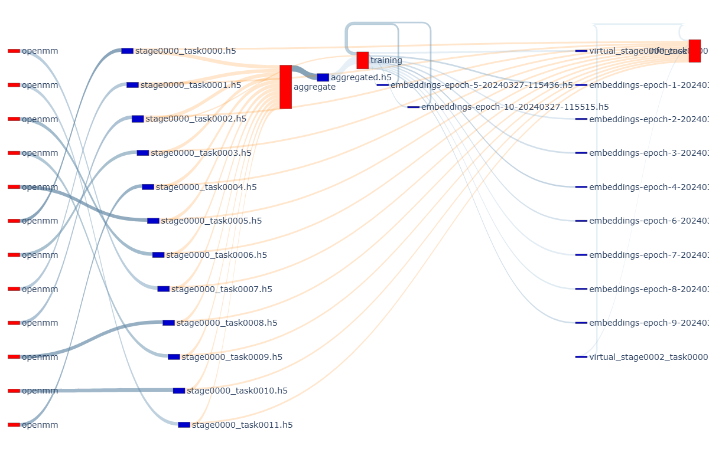
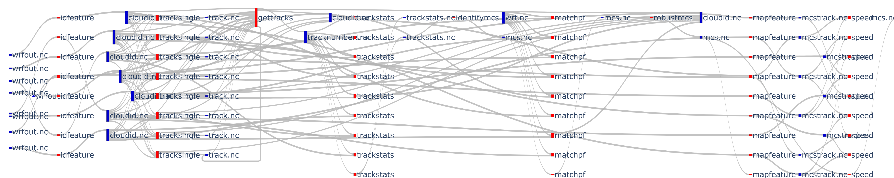
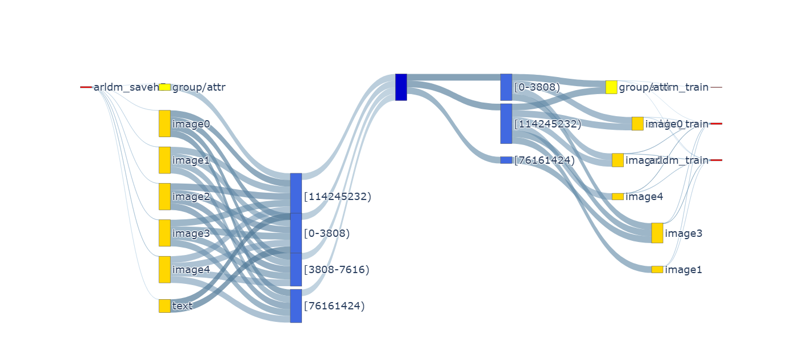

# DaYu-Tracker: Unveiling the I/O Secrets of Scientific Workflows

[](https://opensource.org/licenses/BSD-3-Clause)

**DaYu-Tracker is a comprehensive HDF5 I/O monitoring and analysis toolkit that provides detailed insights into I/O patterns of HDF5 applications at multiple levels. Decode the dataflow semantics and dynamics of your scientific workflows, identify I/O bottlenecks, and optimize performance with interactive visualizations.**

DaYu-Tracker was published at **CLUSTER 2024** and has demonstrated up to a **3.7x performance improvement** in I/O time for obscure bottlenecks.

## Key Features

- **Dual-Layer Monitoring**: Concurrently tracks both high-level HDF5 object operations (VOL) and low-level POSIX I/O activities (VFD).
- **Interactive Visualizations**: Generates insightful Sankey diagrams and network graphs to visualize data flow between tasks, files, and data structures.
- **Performance Analysis**: Identifies I/O bottlenecks, analyzes overhead, and provides actionable recommendations for optimization.
- **Workflow Optimization**: Analyzes data dependencies and I/O patterns across entire scientific workflows.
- **Low Overhead**: Designed for performance, with typically under 0.2% runtime and 0.25% storage overhead.

## Gallery

Here are some examples of the visualizations you can create with DaYu-Tracker:

**DeepDriveMD (ddmd) Workflow Analysis**


**PyFlexTRKR Workflow Analysis**


**ARLDM Workflow Analysis**


## Architecture

DaYu-Tracker consists of two main components:

1.  **VOL (Virtual Object Layer) Tracker**: Monitors HDF5 object-level operations (datasets, groups, attributes).
2.  **VFD (Virtual File Driver) Tracker**: Monitors low-level POSIX I/O operations.

These components work together to provide a holistic view of your application's I/O behavior. The collected data can be analyzed using the provided Python scripts and Jupyter notebooks in the `flow_analysis` directory.

## Installation

### Prerequisites

- **HDF5**: Version 1.14.0 or higher
- **Python**: 3.7+
- **Build Tools**: CMake 3.10+, C++17 compatible compiler

### Building DaYu-Tracker

1.  **Clone the repository**:
    ```bash
    git clone https://github.com/candiceT233/dayu-tracker.git
    cd dayu-tracker
    git submodule update --init --recursive
    ```

2.  **Build the project**:
    ```bash
    mkdir build
    cd build
    cmake -DCMAKE_INSTALL_PREFIX=$(pwd) ..
    make -j$(nproc)
    ```

## Quick Start

### 1. Set Up Task Names

Before running your HDF5 application, set the `CURR_TASK` environment variable to identify the current task:

```bash
export CURR_TASK="my_program"
```

### 2. Run with DaYu-Tracker

Configure the environment variables to enable the VOL and VFD trackers:

```bash
# Set paths
TRACKER_SRC_DIR="../build/src"
LOG_DIR="$(pwd)/dayu_logs"
mkdir -p $LOG_DIR

# Configure VOL connector
export HDF5_VOL_CONNECTOR="tracker under_vol=0;under_info={};path=$LOG_DIR;level=2;format="

# Configure VFD
export HDF5_PLUGIN_PATH=$TRACKER_SRC_DIR/vfd:$TRACKER_SRC_DIR/vol
export HDF5_DRIVER=hdf5_tracker_vfd
export HDF5_DRIVER_CONFIG="$LOG_DIR;8192"

# Run your HDF5 application
python your_hdf5_program.py
```

### 3. Analyze the Results

Use the Jupyter notebooks in the `flow_analysis` directory to analyze the generated logs and create visualizations.

```bash
cd flow_analysis
pip install -r requirements.yaml
jupyter notebook
```

For more detailed instructions and advanced usage, please refer to the documentation in the respective subdirectories.

## Citation

If you use DaYu-Tracker in your research, please cite our paper:

```
@inproceedings{tang2024dayu,
  title={DaYu: Optimizing distributed scientific workflows by decoding dataflow semantics and dynamics},
  author={Tang, Meng and Cernuda, Jaime and Ye, Jie and Guo, Luanzheng and Tallent, Nathan R and Kougkas, Anthony and Sun, Xian-He},
  booktitle={2024 IEEE International Conference on Cluster Computing (CLUSTER)},
  pages={357--369},
  year={2024},
  organization={IEEE}
}
```

**Paper PDF:** [http://cs.iit.edu/~scs/assets/files/tang2024dayu.pdf](http://cs.iit.edu/~scs/assets/files/tang2024dayu.pdf)

## Project Website

For more information, please visit the [DaYu project website](https://grc.iit.edu/research/projects/dayu).

## License

This project is licensed under the terms of the BSD 3-Clause license. See the [LICENSE](LICENSE) file for more details.